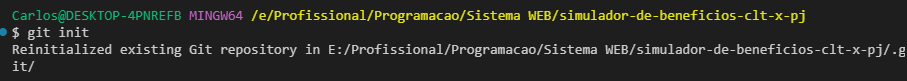
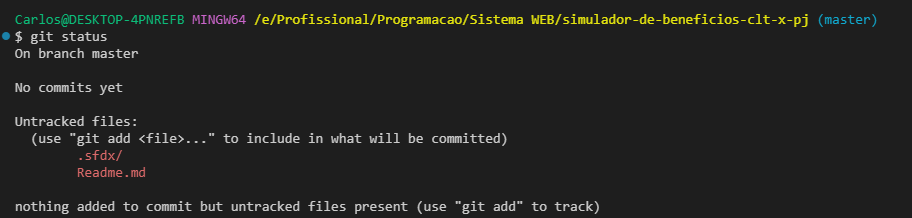
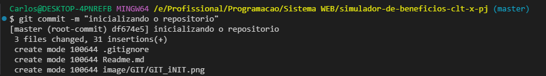
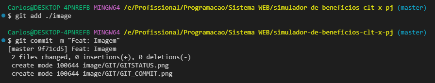

# Simulador de beneficios da CLT e dos beneficios da Pessoa Juridica

## Comando no bash

> - excute  o comando  para iniciar  o repositorio localmente ''git init''
    
> - git config  --global  user.name "seu Nome"
> - git config  --global  user.email "seu email"
> - git status
    
> - touch .gitignore
> - git commit -m "inicializando o repositorio"
    
> - git add ./image
    

## :writing_hand: Linguagens utilizadas

>

## :writing_hand:  Este documento e escrito em

> 

## Acesse minhas redes ou entre contato

> 

## :coffee: Colabore para o cafezinho :coffee:

> [!NOTE]
> "A empatia é certamente um dos mais nobres sentimentos humanos.
> Para entender e ajudar o próximo é necessário se imaginar na condição dele."
[Lázaro de Souza Gomes](https://www.pensador.com/autor/lazaro_de_souza_gomes/)

## Material de Suporte

- [Iconografia](https://github.com/ikatyang/emoji-cheat-sheet/tree/master?tab=readme-ov-file#activities)
- [Badges](https://github.com/digitalinnovationone/dio-lab-open-source/blob/main/utils/badges/badges.md)
- [Cards](https://github.com/digitalinnovationone/dio-lab-open-source/blob/main/utils/cards/github-stats.md)
- [Sintaxe básica de gravação e formatação no GitHub](https://docs.github.com/pt/get-started/writing-on-github/getting-started-with-writing-and-formatting-on-github/basic-writing-and-formatting-syntax)
- [Trabalhar com formatação avançadano GitHub](https://docs.github.com/pt/get-started/writing-on-github/working-with-advanced-formatting)